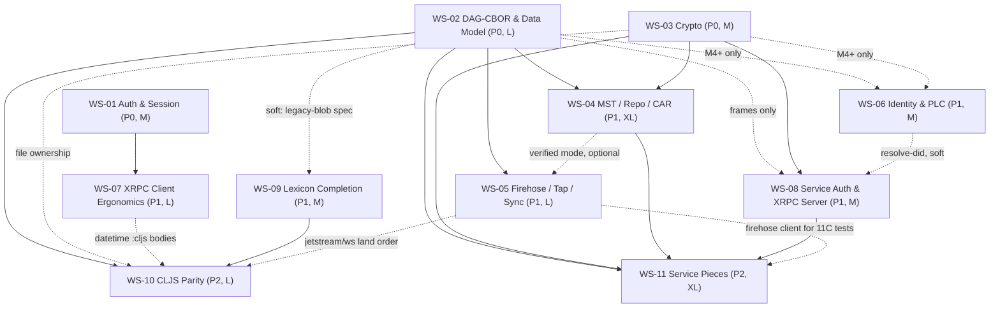

# atproto-clj Parity Plan — Overview

This is the entry point for the parity-plan workstream docs in this directory. Read this first;
then read the individual workstream doc for whatever you are implementing. Workstream docs are
authoritative for their own scope; **this overview is authoritative for cross-workstream
contracts, land order, and conflict resolution** (it records corrections that several workstream
docs still need — see "Interface contracts" and "Known doc corrections").

## 1. Purpose & context

The goal is feature parity with the TypeScript reference implementation at
[`bluesky-social/atproto`](https://github.com/bluesky-social/atproto) (local checkout:
`/Users/luke/github/bluesky-social/atproto`) for SDK *consumers* — auth/session lifecycle,
DAG-CBOR data model, cryptography, MST/repo/CAR, firehose/streaming, identity/PLC, XRPC client
ergonomics, service auth + XRPC server, lexicon resolution/validation, and ClojureScript platform
parity — plus the service-side pieces tracked in the README progress matrix (`README.md:12-33`:
OAuth Backend, Repo Storage, Stream Server, Identity Directory). The work is split into 11
parallelizable workstreams, each with its own planning doc:

| Doc | Workstream |
|---|---|
| [01-auth-session-lifecycle.md](01-auth-session-lifecycle.md) | Auth & Session Lifecycle |
| [02-dag-cbor-data-model.md](02-dag-cbor-data-model.md) | DAG-CBOR & Data Model Completion |
| [03-crypto.md](03-crypto.md) | Cryptography Parity |
| [04-mst-repo-car.md](04-mst-repo-car.md) | MST, Repository & CAR Files |
| [05-sync-streaming.md](05-sync-streaming.md) | Firehose, Tap & Streaming Sync |
| [06-identity-plc.md](06-identity-plc.md) | Identity Completion & PLC Operations |
| [07-xrpc-client-ergonomics.md](07-xrpc-client-ergonomics.md) | XRPC Client Ergonomics & API Conveniences |
| [08-service-auth-xrpc-server.md](08-service-auth-xrpc-server.md) | Service Auth & XRPC Server Completion |
| [09-lexicon-completion.md](09-lexicon-completion.md) | Lexicon Resolution & Validation Modes |
| [10-cljs-platform-parity.md](10-cljs-platform-parity.md) | ClojureScript Platform Parity |
| [11-service-pieces.md](11-service-pieces.md) | Service Pieces (umbrella; decompose into 11A–11D before implementing) |

## 2. Workstream index

| WS | Title | Priority | Size | Branch | Depends on | Blocks |
|---|---|---|---|---|---|---|
| [01](01-auth-session-lifecycle.md) | Auth & Session Lifecycle | P0 | M | `ws/01-auth-session-lifecycle` | none | 07 (shared `xrpc/client.cljc`); anything needing long-lived authed clients |
| [02](02-dag-cbor-data-model.md) | DAG-CBOR & Data Model | P0 | L | `ws/02-dag-cbor-data-model` | none | 04, 05, 06 (M4+), 08 (frames), 09 (soft), 10, 11 |
| [03](03-crypto.md) | Cryptography Parity | P0 | M | `ws/03-crypto` | none | 04, 06 (M4+), 08, 10 (file ownership), 11 |
| [04](04-mst-repo-car.md) | MST, Repository & CAR | P1 | XL | `ws/04-mst-repo-car` | 02, 03 (contract level) | 05 (verified mode, optional), 11B/11C |
| [05](05-sync-streaming.md) | Firehose, Tap & Streaming Sync | P1 | L | `ws/05-sync-streaming` | 02 (hard), 04 (optional, final milestones) | 11C integration tests; 10 (jetstream/ws land order) |
| [06](06-identity-plc.md) | Identity & PLC Operations | P1 | M | `ws/06-identity-plc` | 03 + 02 (M4–M5 only; M1–M3 dep-free) | 08 (soft — can ship against current `resolve-did`) |
| [07](07-xrpc-client-ergonomics.md) | XRPC Client Ergonomics | P1 | L | `ws/07-xrpc-client-ergonomics` | 01 (milestones 5–7); milestones 1–4 dep-free | repo CRUD / error / TID / AT-URI consumers; 10 (datetime `:cljs` bodies) |
| [08](08-service-auth-xrpc-server.md) | Service Auth & XRPC Server | P1 | M | `ws/08-service-auth-xrpc-server` | 03; 06 (soft); 02 (frames only) | 11 (frames, subscription transport, server `:auth`) |
| [09](09-lexicon-completion.md) | Lexicon Resolution & Validation | P1 | M | `ws/09-lexicon-completion` | none hard (02 soft) | 10 (eval-free registration gates cljs lexicon tests) |
| [10](10-cljs-platform-parity.md) | ClojureScript Platform Parity | P2 | L | `ws/10-cljs-platform-parity` | 02, 03 (file ownership), 09; rebases over 05/07 | none (terminal); unblocks honest README matrix |
| [11](11-service-pieces.md) | Service Pieces (umbrella) | P2 | XL | `ws/11-service-pieces` (+ `ws/11a-oauth-provider`, `ws/11b-repo-storage`, `ws/11c-stream-server`, `ws/11d-plc-directory`) | 02, 03, 04, 08 (+05's firehose client for 11C integration tests) | future "minimal Clojure PDS assembly" workstream |

## 3. Dependency graph

Contract-level dependencies (solid = hard dependency, dashed = soft/optional or land-order
handshake). P0 foundations at the top. Acyclic; merge anywhere along a topological order.



## 4. Interface contracts

These are the **frozen** Clojure signatures that cross workstream boundaries. Implementing agents
code against these (with stubs/vendored fixtures) before the providing workstream merges. Where
two docs disagreed, the owning workstream's signature wins; the disagreement and the doc needing
the fix are recorded inline and summarized in §4.9.

### 4.1 DAG-CBOR & data model — owner WS-02 (consumed by 04, 05, 06, 08, 09, 11)

All synchronous, all `.cljc`. Invalid input **throws** `ex-info` (ex-data is an SDK error map);
these codecs never *return* error maps because `{:error ...}` is itself valid atproto data.

```clojure
(atproto.data.cbor/encode data)            ;; => platform bytes        (throws ex-info)
(atproto.data.cbor/decode bytes)           ;; => data, no trailing     (throws ex-info)
(atproto.data.cbor/decode-first bytes)     ;; => [data bytes-consumed] (throws ex-info)
(atproto.data.cbor/decode-multi bytes)     ;; => vector of data        (throws ex-info)
(atproto.data/cid-for data)                ;; => CID (v1, dag-cbor 0x71, sha2-256)
(atproto.data/verify-cid cid bytes)        ;; => true | {:error "CidMismatch" ...}
                                           ;;         | {:error "UnsupportedHashAlgorithm" ...}
(atproto.data/blob-ref bytes)              ;; => CID (v1, raw 0x55, sha2-256) — fixed: now hashes
(atproto.data/cid-link cbor-bytes)         ;; => CID (v1, dag-cbor, sha2-256) — fixed: now hashes
(atproto.data/legacy-blob? v)              ;; => boolean
(atproto.data/upgrade-legacy-blob m)       ;; => typed blob map | nil
:atproto.data/legacy-blob                  ;; spec (consumed by WS-09's lenient mode)
(atproto.runtime.varint/encode n)          ;; => bytes
(atproto.runtime.varint/decode bytes)      ;; => n
(atproto.runtime.varint/read-bytes b off)  ;; => [n bytes-read]
```

Decoded data shape: unqualified-keyword map keys, `multiformats.cid` objects for tag-42 links,
platform bytes for byte strings, vectors for arrays, `nil`/booleans/longs/strings for scalars —
exactly `:atproto.data/value` (`src/atproto/data.cljc:128-138`). CBOR `null` round-trips for
`nil`-valued keys (commit `:prev`, MST node `:l`/`:t` are encoded as null, never omitted).

Two non-negotiables every consumer must respect:
- **Decode does not enforce sorted map keys** — commit verification (WS-04/05) must always hash
  the *original* bytes, never re-encoded ones.
- **`cid-link`/`blob-ref` change behavior** when WS-02 lands: the current code at
  `src/atproto/data.cljc:24-31` and `:40-47` calls `multiformats.hash/create` (which wraps an
  already-computed digest) instead of `multiformats.hash/sha2-256` (which hashes), so today they
  produce garbage CIDs. Any branch creating CIDs rebases onto the fix; never copy the old call.

> Correction: WS-08's doc names the multi-item decode `decode-seq` — the actual contract is
> `decode-multi` (+ `decode-first` for `[value bytes-consumed]`). **Fix in 08.**
> WS-04's hedge ("`{:error "InvalidCbor"}` or throws — confirm w/ WS-02") is resolved: it throws.

### 4.2 Cryptography — owner WS-03 (consumed by 04, 06, 08, 10, 11)

**Key operations are ASYNC** (decided 2026-06-10, superseding the earlier sync proposal): `sign`,
`verify`, `verify-did-sig`, `generate`, `import-private-key`, `jwt/verify`, `jwt/sign` follow the
SDK callback convention (`& {:as opts}` with `:callback`/`:promise`/`:channel` via
`atproto.runtime.interceptor/platform-async`) so a cljs backend can use WebCrypto (Promise-based;
P-256; non-extractable keys) interchangeably with `@noble/curves`. JVM impls compute synchronously
and adapt. Pure parsing/encoding and `sha256` stay synchronous (`sha256` permanently — it sits in
tight loops: MST key depth, CID hashing). Errors are `{:error "Name" :message ...}` maps, never
thrown; `verify` yields plain `false` for well-formed-but-invalid signatures.

```clojure
;; atproto.crypto
(sign keypair msg-bytes & opts)                       ;; async => 64-byte compact low-S sig bytes
(verify pubkey-bytes sig-bytes msg-bytes
        & {:keys [alg allow-malleable?] :as opts})    ;; async => boolean (strict by default:
                                                      ;;    64-byte compact + low-S required)
(verify-did-sig did-key sig-bytes msg-bytes & opts)   ;; async => boolean | {:error ...} for bad did:key
(did-key->pubkey did)                                 ;; => {:alg "ES256"|"ES256K"
                                                      ;;     :bytes uncompressed-65-byte-pubkey}
                                                      ;;    | {:error ...}
(pubkey->did-key alg pubkey-bytes)                    ;; => "did:key:z..." | {:error ...}
(parse-multikey multikey-str)                         ;; => {:alg .. :bytes ..} | {:error ...}
(format-multikey alg pubkey-bytes)                    ;; => "z..."
(compress-pubkey alg pubkey-bytes)                    ;; => 33 bytes | {:error ...}
(decompress-pubkey alg pubkey-bytes)                  ;; => 65 bytes | {:error ...}
(alg keypair)                                         ;; sync => "ES256" | "ES256K"
(public-key keypair)                                  ;; sync => 33-byte compressed pubkey bytes
                                                      ;;   (public bytes captured at key creation,
                                                      ;;    so accessors are sync even on WebCrypto)
(did keypair)                                         ;; sync => "did:key:z..."
(generate alg & {:keys [exportable?] :as opts})       ;; async => Keypair | {:error ...}
(import-private-key alg priv & opts)                  ;; async => Keypair | {:error ...}
(multibase->bytes s)                                  ;; multiformats.base/parse
(bytes->multibase base-key b)                         ;; e.g. :base58btc

;; atproto.runtime.jwt (additions; existing Nimbus generate/JWK fns untouched)
(parse jwt-str)             ;; => {:header :claims :signing-input :signature} | {:error "MalformedJwt"}
(verify jwt-str key & opts) ;; async => {:header :claims} | {:error "MalformedJwt"|"BadJwtSignature"|
                            ;;    "JwtExpired"|"UnsupportedAlgorithm" ...}
                            ;;    key: did:key string | {:pubkey {:alg :bytes}} | {:jwk {...}}
                            ;;    :allow-malleable? defaults TRUE (service-JWT parity,
                            ;;    xrpc-server/src/auth.ts:178-187); repo commits verify strictly
(sign keypair headers claims & opts) ;; async => compact JWS string

;; atproto.runtime.crypto
(sha256 bytes-or-str)       ;; => digest bytes (fixed: now accepts byte arrays AND strings)
(base64url-decode s)        ;; => bytes | nil
(hex-encode b) / (hex-decode s)
```

Legacy DID-doc key conversion is a **composition**, not a single fn: `Multikey` verification
methods → `(parse-multikey s)` then `pubkey->did-key`; legacy `EcdsaSecp256k1VerificationKey2019`
/ `EcdsaSecp256r1VerificationKey2019` → `(pubkey->did-key alg (multibase->bytes s))`
(see `packages/identity/src/did/atproto-data.ts:20-41` in the reference).

> Corrections (WS-03 owns the namespace; its signatures win):
> - DID-dispatched verification is `verify-did-sig` with arg order **sig-bytes then msg-bytes**,
>   yielding a boolean (async, callback convention). **Fix in 04** (writes `(crypto/verify did-key data-bytes sig)`),
>   **06** (writes `(verify did-key bytes sig-bytes)` — name wrong), and **08** (writes
>   `(crypto/verify-signature did-key msg-bytes sig-bytes ...) → {:valid? bool}` — async was right,
>   but name/shape wrong: yields a plain boolean).
> - The keypair DID accessor is `(did keypair)`, not `did-key`. **Fix in 04, 06, 08.**
> - The alg accessor is `(alg keypair)`, not `jwt-alg`; generation is `(generate alg ...)`, not
>   `generate-keypair`; `sign` is async yielding raw sig bytes, not `{:sig bytes}`. **Fix in 08.**
> - There is no `multibase->did-key` fn; use the composition above (or WS-03 may add the
>   convenience wrapper — orchestrator call). **Fix in 06, 08.**
> - Hex helper is `hex-encode`, not `bytes->hex`. **Fix in 08** (WS-08 drops its duplicate
>   `runtime.crypto` additions at rebase anyway).

### 4.3 Session & auth-retry — owner WS-01 (consumed by 07; implemented by 08's service-auth session)

```clojure
;; atproto.xrpc.client
(defprotocol Session
  :extend-via-metadata true
  (auth-interceptor [session])     ;; interceptor to authenticate HTTP requests
  (refresh-token [session cb]))    ;; cb called EXACTLY ONCE with a new Session value
                                   ;; (refreshed tokens) or an {:error ...} map; never hangs

(invalid-token-response? http-response) ;; public; expired-token-error? kept as deprecated alias
(init {:keys [service session validate-requests?]}) ;; config keys unchanged; WS-01 adds only
                                                    ;; namespaced keys (::refresh-state) which
                                                    ;; WS-07 must treat as opaque and preserve
```

`delegate-auth-interceptor` keeps its name and position between the lexicon-level interceptors
and `atproto-json` in the chains; WS-07 may reorder/extend the chains but must preserve the
request-snapshot/`::auth-retried?` keys it manages. (Today's protocol lives at
`src/atproto/xrpc/client.cljc:38-41`.)

### 4.4 Blockstore, commit-data & CAR — owner WS-04 (implemented by 11B; consumed by 05, 11C)

```clojure
;; atproto.repo.blockstore — synchronous protocols; THE contract WS-11B implements over SQLite
(defprotocol ReadableBlockstore
  (get-bytes [bs cid])        ;; => bytes | nil
  (has-block? [bs cid])       ;; => boolean
  (get-blocks [bs cids]))     ;; => {:blocks {cid bytes} :missing [cid ...]}

(defprotocol WritableBlockstore
  (get-root [bs])             ;; => CID of current root commit | nil
  (put-block! [bs cid bytes])
  (put-blocks! [bs block-map])
  (update-root! [bs cid rev])
  (apply-commit! [bs commit-data])) ;; atomic: delete :removed-cids, add :new-blocks, set root

;; commit-data map shape (produced by atproto.repo/format-commit; consumed by 11B/11C):
{:cid cid :rev tid :since tid-or-nil :prev cid-or-nil
 :new-blocks block-map           ;; new MST nodes + new leaf records + commit
 :relevant-blocks block-map      ;; ⊇ new-blocks (+ covering-proof blocks)
 :removed-cids cid-set}

;; atproto.repo.car (consumed by 05 once it supersedes the provisional atproto.sync.car)
(write-car root blocks)                       ;; => CAR v1 bytes
(read-car bytes & {:keys [skip-cid-verification?]})
  ;; => {:roots [cid ...] :blocks [{:cid c :bytes b} ...] :block-map {...}} | {:error "InvalidCar"}
(read-car-with-root bytes & opts)             ;; => {:root cid ...} | {:error ...}

;; atproto.repo.sync (consumed by 05's verified mode)
(verify-repo block-map root & {:keys [did signing-key ensure-leaves?]})
(verify-diff repo block-map root & opts)
(verify-proofs car-bytes claims did did-key)  ;; claims: [{:collection c :rkey r :cid cid-or-nil}]
```

A "block-map" is a plain persistent map of CID → byte-array; a "cid-set" is a plain set of CIDs
(`multiformats.cid` values implement equality/hashing).

> Corrections: WS-11's restated assumptions use `has?` (→ `has-block?`), `put-many!`
> (→ `put-blocks!`), and a commit-data key `:prev-data` (→ `:prev`). **Fix in 11.**

### 4.5 Identity cache & resolution — owner WS-06 (consumed by 05, 08, 09)

```clojure
;; atproto.identity.cache — synchronous storage protocol; policy computed by the SDK
(defprotocol Cache
  (get* [cache k])        ;; entry map {:val ... :updated-at <epoch-ms>} | nil
  (set* [cache k entry])
  (del* [cache k])
  (clear* [cache]))

(memory-cache)                       ;; default atom-backed impl
default-policy                       ;; {:stale-ttl 1h :max-ttl 24h :negative-ttl nil}
(check cache policy k)               ;; => nil | {:val :updated-at :stale? :expired? :negative?}

;; atproto.identity
(resolve-did did & {:keys [cache cache-policy force-refresh plc-url]})
  ;; async => {:did-doc doc} | {:error "DidNotFound"|"UnsupportedDidMethod"|
  ;;          "UnsupportedDidWebPath"|"PoorlyFormattedDidDocument" ...}
  ;; stale-while-revalidate semantics; :force-refresh bypasses the cache read
(resolve-identity at-identifier & {:as same-opts})  ;; adds {:error "InvalidAtIdentifier"} (no hang)
(did-doc-signing-key did-doc & {:keys [key-id]})    ;; {:type ... :public-key-multibase ...} | nil
(did-doc-signing-did-key did-doc)                   ;; "did:key:z..." | nil (uses WS-03 conversion)
```

WS-08 may ship against the *current* `resolve-did` (no cache, every call fresh, ignoring its
`force-refresh` flag) and picks up WS-06's behavior transparently through its own
`:get-signing-key` indirection `(fn [iss force-refresh? cb])`.

> Correction: the option is `:force-refresh` (WS-06 owns it); WS-08's doc writes `force-refresh?`
> as the resolve-did kwarg. **Fix in 08** (cosmetic; 08's internal callback arg name is its own).

### 4.6 Cursor persistence — owner WS-05 (consumed by firehose, Jetstream, runner, future indexers)

```clojure
;; atproto.sync.cursor
(defprotocol CursorStore
  :extend-via-metadata true
  (get-cursor [store cb])         ;; cb {:cursor n} ({:cursor nil} when none) | {:error ...}
  (set-cursor [store cursor cb])) ;; cb {} | {:error ...}

(memory-store & {:keys [cursor]})
```

Firehose cursors are relay seqs; Jetstream cursors are µs timestamps — same protocol.

### 4.7 Event-stream frames — owner WS-08 (`atproto.xrpc.frames`, consumed by 11C; duplicated by WS-05's `atproto.sync.frame` — see §4.9 item 8)

A frame is exactly two concatenated DAG-CBOR items: header `{:op 1, :t "#commit"}` (message) or
`{:op -1}` (error, body `{:error name :message msg?}`); pure/sync `.cljc`.

```clojure
;; atproto.xrpc.frames
(encode frame)          ;; => bytes (header item ++ body item)
(decode bytes)          ;; => {:op 1 :t "#x" :body {...}} | {:op -1 :body {:error ...}}
                        ;;    | {:error "InvalidFrame" :message ...}
(message-frame body & {:keys [nsid]})   ;; lifts body :$type into header :t, compressed to "#frag"
(error-frame error & [message])
```

Server side (WS-08, consumed by 11C): `atproto.xrpc.server/handle-subscription` multimethod
returning `{:messages ch}` (+ `:close-ch` in the request map), error item
`{:frame/error "Name"}` → error frame + WS close 1008; channel close → close 1000. Per-route
auth: `:auth` config map of nsid → async verifier `(fn [ctx cb])` yielding `{:credentials ...}`
or `{:error ... :status 401/403}`; `atproto.xrpc.rate-limit/RateLimiter` protocol
(`consume`/`reset`) for hook points.

### 4.8 Other frozen contracts (summary; see owning docs)

- **WS-07 — XRPC error map** (all XRPC failures): `{:error <string> :message <string>? :status
  <int>? :headers <map>? :retryable? <boolean> :http-response <map>?}`; retryable statuses
  `#{408 425 429 500 502 503 504 522 524}` minus 401; server JSON `:error` names preserved
  verbatim. Plus `atproto.tid` (`next-tid` 0/1-arity, `parse`, `timestamp`, `from-time`,
  `compare-tids`, `valid?` — always exactly 13 chars), `atproto.at-uri`
  (`parse`/`make`/`valid?`/accessors), `atproto.runtime.retry/with-retry`, and
  `atproto.runtime.datetime/current-datetime|normalize|normalize-or-epoch` (WS-07 defines
  signatures + `:clj` bodies; WS-10 implements `:cljs`).
- **WS-08 — service auth**: `atproto.service-auth/create-jwt|auth-headers|verify-jwt|
  did-signing-key-resolver|get-service-auth|session`; fixed error names `MissingJwt`, `BadJwt`,
  `BadJwtType`, `JwtExpired`, `BadJwtAudience`, `BadJwtLexiconMethod`, `BadJwtIss`,
  `BadJwtSignature`, `UntrustedIss`.
- **WS-09 — lexicon**: `register-specs!` (same name/arity, eval-free, idempotent),
  `request-spec-key`/`response-spec-key`/`message-spec-key` (return value stays "something
  `s/valid?` accepts" — keyword **or** predicate fn), `*schema-validate*` unchanged, new
  `*strict*` (dynamic boolean, default `true` — the only lenient-mode switch),
  `valid-record-key?`/`record-key-spec`, `atproto.lexicon.resolver/resolve-nsid`,
  `resources/lexicons/manifest.edn` format `{:source :commit :fetched :files}`.
- **WS-05 — event shapes**: `:kind`-keyed firehose events (`:create/:update/:delete/:sync/
  :identity/:account/:info/:gap`) and `:type`-keyed Tap events; wire lexicon fields stay
  camelCase, envelope keys kebab-case. `atproto.runtime.ws/connect|send!|close!|connected?`
  (reconnecting WebSocket consumer runtime).
- **WS-10 — runtime cljs contracts**: `datetime/parse` (string → platform datetime | nil),
  `string/utf8-length|grapheme-length` (→ int, never nil), `dns/interceptor` (request
  `{:hostname :type}` → `{:values [...]}`/`{:error ...}`, total on cljs via DoH),
  `http/handle-request` cljs response contract (string body for JSON/text, `js/Uint8Array`
  otherwise; `{:error "HTTPClientError"}` on network failure).
- **WS-11 — provider/PDS**: `atproto.oauth.provider/verify-access-token` (the hook WS-08's auth
  middleware calls), `atproto.pds.blobstore/BlobStore` protocol,
  `atproto.pds.actor-store/read-actor|transact-actor!`, `atproto.pds.sequencer` write API +
  `atproto.pds.firehose/handler`.

### 4.9 Known doc corrections (apply at kickoff of the affected workstream)

1. **04, 06, 08** — crypto fn names/arg order/async-ness per §4.2 (key operations are async per
   the callback convention; `verify-did-sig` sig-then-msg boolean; `did` not `did-key`; `alg` not
   `jwt-alg`; `generate` not `generate-keypair`; `sign` yields bytes; no `multibase->did-key`).
2. **08** — `atproto.data.cbor/decode-multi` (not `decode-seq`); `hex-encode` (not `bytes->hex`);
   `:force-refresh` resolve-did option spelling.
3. **11** — blockstore method names `has-block?`/`put-blocks!`; commit-data key `:prev` (not
   `:prev-data`). Also: WS-11's dependency labels swap 05↔08 in places — server-side auth
   middleware and the websocket/frame transport are **WS-08**; the Clojure firehose *client* used
   by 11C's integration tests is **WS-05**.
4. **03** — `runtime.crypto/base64-encode` must emit **unpadded** standard base64 (WS-02's fix,
   required by the atproto `$bytes` form; `base64-decode` accepts padded and unpadded). WS-03's
   doc describes it as "with padding"; the unpadded semantics win.
5. **07** — its new convenience namespace collides with WS-04 on `src/atproto/repo.cljc` (see
   conflict matrix). WS-04 keeps `atproto.repo` (parity with `@atproto/repo` = MST/commits);
   WS-07 renames its CRUD-wrapper ns (recommendation: `atproto.client.repo`, test at
   `test/atproto/client/repo_test.cljc`).
6. **10** — `now-string` duplicates WS-07's `current-datetime`; adopt WS-07's name. Keep WS-10's
   `parse`/`->string`/`current-time-millis`.
7. **10** — do not create `src/atproto/runtime/websocket.cljc`; WS-05 lands
   `src/atproto/runtime/ws.cljc` (reconnect/backoff/heartbeat) first, and WS-10 adds the `:cljs`
   branch there and ports Jetstream on top of it (WS-10 already owns the
   `jetstream.clj → jetstream.cljc` rename; it rebases over WS-05's jetstream changes).
8. **05 / 08** — duplicate frame codecs (`atproto.sync.frame` vs `atproto.xrpc.frames`). One
   codec should exist, and the surviving namespace is **`atproto.xrpc.frames` regardless of land
   order** (pure `.cljc`; it is the §4.7 contract WS-11C consumes). If WS-08 lands second, it
   still keeps the canonical name: it ports/deletes WS-05's `atproto.sync.frame` implementation
   and updates WS-05's call sites to `atproto.xrpc.frames`. If WS-05 lands second, it never
   creates `atproto.sync.frame` and consumes `atproto.xrpc.frames` directly. Either way, the
   `message-body`/`$type`-reconstruction helper moves to wherever the firehose client needs it.
   Owners confirm at kickoff.
9. **04** — its risk 7 ("extend `atproto.tid/next-tid` with an optional floor arity … likely fine
   inside WS-04 M5") is resolved: WS-07 already lands exactly that arity in its milestone 1
   (dep-free) — `(next-tid prev)` returns a TID strictly newer than `prev`
   (07-xrpc-client-ergonomics.md §"TID"). WS-04 consumes WS-07's arity in M5 instead of adding
   its own; do not create a second/conflicting arity on `src/atproto/tid.cljc` (see conflict
   matrix). **Fix in 04** (risk 7).

## 5. Parallel execution guide

How N agents work simultaneously:

**Branching & PR discipline.** One branch per workstream, named `ws/NN-slug` exactly as in the
index above (WS-11 decomposes into `ws/11a-…`–`ws/11d-…`). Each workstream is a series of
*small* PRs against `main` — one PR per milestone as enumerated in each doc — every PR
independently green (`clojure -X:test`; plus the cljs job once WS-10's CI lands). Do not
accumulate a giant branch; merge milestones as they finish.

**Developing before your dependencies merge.** Code against the frozen contracts in §4 by name;
never invent alternate signatures. Keep calls to a not-yet-merged contract behind one or two tiny
internal wrapper fns so integration is a two-line change. Use:
- test-only DAG-CBOR stubs under `test/` (WS-04: `test/atproto/repo/test_support/cbor_stub.cljc`;
  WS-05: `test/atproto/support/cbor_stub.clj`; WS-06: a ~40-line string/array/map/null encoder;
  WS-08: a shim for frames) — all deleted when WS-02 merges; nothing CBOR-shaped in `src/`.
- fake signers / injected verify fns until WS-03 merges (real ES256K tests flip on after).
- scripted/stubbed HTTP (`test/atproto/test_support/http.cljc`, created by WS-01, reused by 07)
  and stub DNS interceptors — no live network in CI.
- vendored fixtures (see each doc's Test plan): interop crypto/syntax files are already under
  `test/interop-test-files/`; repo/CAR/commit-proof fixtures, the lex-cbor data-model fixtures,
  generated frame/JWT fixtures, and PLC audit logs get vendored per-workstream with provenance
  notes.

**Recommended merge order** (topological; parallelize within rows):

1. **WS-01** first (it rewrites `src/atproto/xrpc/client.cljc`; everyone else rebases around it).
   WS-07 milestones 1–4 (tid/at-uri/datetime/error+retry) are dep-free and can merge in parallel.
2. **WS-02 and WS-03** next (P0 foundations; independent of each other — coordinate the small
   `runtime/crypto.cljc` overlap, see matrix). Their merges un-stub 04/05/06/08.
3. **WS-06, WS-07 (5–7), WS-08, WS-09** in any order (mutually independent; 09's one-line
   `*strict*` bindings in xrpc client/server rebase trivially against 07/08).
4. **WS-04**, then **WS-05** (05's provisional `atproto.sync.car` + cbor stub get superseded;
   05's final verified-mode milestones need 04).
5. **WS-10** after 02/03/09 (it lands last among the library workstreams and rebases over shared
   files: deps.edn, README, test namespaces, jetstream).
6. **WS-11** last, decomposed into 11A–11D with their own milestone PRs (11A M1–M5 can actually
   start any time after WS-03; 11B M2+ needs WS-04; 11C M3 needs WS-02/04/08).

**File-ownership conflict matrix** (single-owner rule: only the listed owner touches the file
while their workstream is in flight; others rebase):

| File / path | Workstreams | Resolution |
|---|---|---|
| `src/atproto/xrpc/client.cljc` | 01, 07, 08, 09 | **01 owns and lands first**; 07 rebases (milestones 5–7 wait for 01); 08 avoids touching it; 09 adds a one-line `*strict*` binding only. |
| `src/atproto/repo.cljc` + `test/atproto/repo_test.cljc` | **04 vs 07 — both create it** | **04 keeps `atproto.repo`** (MST/commits, TS parity); 07 renames its XRPC CRUD ns (recommend `atproto.client.repo`). Decide before either lands. |
| `src/atproto/runtime/crypto.cljc` | 02, 03, 06, 08, 10 | **03 owns the file**; 02 owns the base64 semantics (unpadded encode + `:cljs` branches); land 02/03 in either order, second rebases (overlap is only `base64-encode`). 06 drops its sha256 change (03 covers it); 08 drops its `base64url-decode`/hex duplicates; **10 never touches it**. |
| `src/atproto/runtime/jwt.cljc` | 03, 11A | **03 owns** (adds `parse`/`verify`/`sign` for ES256/ES256K); 11A extends `verify` with keyset/embedded-JWK modes on top, rebasing. 08/10 never touch it. |
| `src/atproto/runtime/bytes.cljc` | 02, 04, 10 | **02 owns** (`eq?` `:cljs`); 04 adds `concat-bytes`/`slice` additively and rebases; 10 owns any `Int8Array`→`Uint8Array` standardization decision. |
| `src/atproto/data.cljc`, `src/atproto/data/json.cljc` | 02 (owner), 04, 09, 10 | 02 owns all changes incl. the `cid-link`/`blob-ref` digest fix (`src/atproto/data.cljc:24-31,40-47`); 04 must not race it; 09 consumes `::data/legacy-blob`, never redefines it; 10 limits itself to test-ns `:refer :all` fixes (drop on conflict). |
| `src/atproto/jetstream.clj` | 05, 10 | **05 owns first** (rebase onto `atproto.runtime.ws`, typed events, cursor-store); 10 then renames to `.cljc` + adds cljs, rebasing. |
| `src/atproto/runtime/ws.cljc` vs `runtime/websocket.cljc` | 05, 10 | One namespace: 05's `atproto.runtime.ws`. 10 adds the `:cljs` branch there instead of creating `runtime/websocket.cljc` (§4.9 item 7). |
| `atproto.sync.frame` (05) vs `atproto.xrpc.frames` (08) | 05, 08 | Duplicate codec; consolidate per §4.9 item 8 — surviving namespace is `atproto.xrpc.frames` **regardless of land order** (second lander migrates/deletes `atproto.sync.frame` and updates its call sites). |
| `src/atproto/sync/car.cljc` (05) vs `atproto.repo.car` (04) | 05, 04 | Agreed in both docs: 05 ships the minimal read-only reader first; 04 supersedes it and updates the single call site (or 05 deletes its reader if 04 lands first). |
| `src/atproto/runtime/datetime.cljc` | 07, 09, 10 | Disjoint fns: 07 adds `normalize`/`normalize-or-epoch`/`current-datetime` (`:clj`), 09 adds `parse-lenient`, 10 adds `:cljs` branches last. 10 drops `now-string` (§4.9 item 6). |
| `src/atproto/tid.cljc` | 07, 04 | **07 owns** (lands milestone 1, dep-free: 13-char padding fix, `parse`/`from-time`/`compare-tids`/`valid?`, and the `next-tid` 0/1-arity where `(next-tid prev)` guarantees strictly-newer-than-`prev`). 04 does **not** add its own floor arity (its risk 7 proposal): WS-07's `(next-tid prev)` *is* that floor — 04 consumes it in M5 (`format-commit` rev generation). §4.9 item 9. |
| `src/atproto/runtime/http.cljc` | 07, 10 | 07 makes a minimal cljs timeout/abort change; 10's fetch rewrite subsumes it — 10 rebases and preserves the `:timeout`/`{:error "Timeout"}`/abort semantics 07 froze. |
| `src/atproto/xrpc/server.cljc` | 08, 09, 11 | **08 owns**; 09 adds a one-line `*strict*` binding; 11 consumes and rebases on 08. |
| `deps.edn` | 03 (BouncyCastle), 05 (`:zstd` alias), 11 (sqlite/next.jdbc) | All additive one-liners; second lander rebases. Tink removal is 03's open question. |
| `README.md` | 04, 10, 11 | Progress-matrix updates only in each workstream's final milestone PR; last lander rebases. 10 does the full matrix audit. |
| `resources/lexicons/**` | 09 (owner: 251 files + manifest), 01 (optionally vendors 4 `com/atproto/server/*.json`) | Byte-identical copies from the same reference commit; whoever lands second rebases; 09's manifest must list whatever 01 added. |
| `test/interop-test-files/repo/*` | 04, 11B | Identical vendored copies; first lander creates the dir, the other rebases (content-free conflict). |
| `test/atproto/xrpc/client_test.cljc` | 01, 07 | 01 creates; 07 extends (merge files). |
| Test-namespace `:refer :all` fixes | 10 vs 02/09 owners | 10 applies mechanical fixes only where the owning workstream hasn't already; drop on conflict. |

## 6. Conventions

All workstreams follow the existing SDK conventions (do not innovate per-workstream):

- **`.cljc`-first**: platform branches via `#?(:clj ...)` / `#?(:cljs ...)`; no `:cljd` branches
  in new code. JVM-only transports (`ring.clj`, SQLite, websocket server) stay `.clj`; pure logic
  stays cross-platform. `(set! *warn-on-reflection* true)` in JVM-relevant namespaces.
- **Async**: I/O-bound public fns take trailing `& {:as opts}` and dispatch through
  `atproto.runtime.interceptor/platform-async` (`:callback`/`:promise`/`:channel`); HTTP/DNS go
  through interceptor chains with `i/execute`. Pure CPU-bound code (codecs, MST) is
  synchronous, following the `atproto.data`/`atproto.tid` precedent — **except crypto key
  operations, which are async by decision (§4.2) for WebCrypto compatibility on cljs**. Observability via
  `atproto.runtime.cast` (no `tap>`/`println`).
- **Errors**: `{:error "PascalCaseName" :message "..."}` maps delivered through the async value —
  never thrown across a public API boundary, never a bare string, and **never a hang** (every
  failure path delivers exactly once). Pure codecs are the exception: they throw `ex-info`
  carrying the same map in `ex-data` (§4.1).
- **Specs**: `clojure.spec.alpha` for public fn inputs and wire/data shapes.
- **Fixtures**: vendored interop test files live under `test/` (`test/interop-test-files/...` or
  per-area `fixtures/` dirs) with provenance (source path + reference commit); generated fixtures
  commit both the generation script and its output. Reference repo pinned at commit `b9ef557`
  unless a doc says otherwise; re-`diff` at implementation time.
- **Every PR green**: `clojure -X:test` (and the cljs job once it exists) passes on every
  milestone PR; live-network tests are `^:integration`-tagged/manual, never in default CI.

## 7. Out of scope (whole plan)

- **app.bsky typed helpers, RichText, moderation, post/social-graph/label/preferences helpers** —
  explicitly not planned for this SDK (`README.md:43`).
- **Lexicon codegen / typed client wrappers** — N/A by design (`README.md:26`); runtime spec
  registration (WS-09) is the substitute.
- **ozone, bsync, bsky appview, feed-generator services** — permanently out of scope.
- **PLC directory service implementation** — 11D delivers a go/no-go memo only (default: defer);
  the PLC *client* (operation signing/submission) is in scope via WS-06.
- **Full PDS assembly** (account manager, `com.atproto.server.*`/`com.atproto.repo.*` route
  handlers, handle provisioning) — a future workstream consuming WS-11's pieces.
- **OAuth provider login/consent UI** — hooks only, host apps render pages (11A).
- **ClojureDart parity** — future effort; no `:cljd` branches added anywhere.
- **Cryptography on ClojureScript** — `atproto.crypto`, `runtime.jwt` `parse`/`verify`/`sign`,
  and `runtime.crypto` (sha256/hex/base64url beyond WS-02's base64 `$bytes` fix) remain
  **JVM-only after this whole plan**: WS-03 documents cljs crypto as a deferred stretch and
  WS-10 explicitly never touches `runtime/crypto.cljc`, `runtime/jwt.cljc`, or `crypto.cljc`
  (03-crypto.md "Explicit coordination notes"). Consequently OAuth/DPoP, commit-signature
  verification, service-JWT verification, and did:key handling are all non-functional on
  ClojureScript; the WebCrypto/@noble follow-up is documented (WS-03/WS-10), not implemented.
- **Blob download conveniences** — `com.atproto.sync.getBlob` / binary response bodies
  (reference: `packages/lex/lex-client/src/client.ts:811-816`) and the streaming blob CID
  verifier (`packages/common/src/ipld.ts:104-126` `VerifyCidTransform`) are covered by **no
  workstream**: WS-07 defers binary response bodies as an open question and WS-02 defers the
  streaming verifier "to the workstream that implements blob fetch". A follow-up workstream
  after WS-07/WS-10 land binary response support (cljs fetch already returns `js/Uint8Array`
  for binary, §4.8) should deliver both.

## 8. Open questions for the orchestrator

Cross-workstream decisions not settled inside any single doc (per-workstream open questions live
in each doc's Risks section):

1. `atproto.repo` namespace collision (04 vs 07) — confirm the §4.9 item 5 resolution before
   either workstream's affected milestone.
2. WebSocket runtime consolidation (05 vs 10) and frame-codec consolidation (05 vs 08) — confirm
   §4.9 items 7–8 with the three owners.
3. `multibase->did-key` convenience: add to WS-03's surface, or have 06/08 compose (§4.2)?
4. Remove the unused Tink dependency in WS-03's deps.edn PR? (No planned workstream uses it.)
5. Async `Store`/cache protocols: stay synchronous everywhere for now (01/06/11 all assume so);
   who owns a future async-ification if needed?
6. cljs DoH default endpoint: default-on (Cloudflare, leaks handle lookups) vs opt-in (TS parity)
   — WS-10 M4.
7. Jetstream zstd dictionary vendoring/licensing (05) — drop if unclear.
8. `jwt/verify` lenient-by-default malleability (03) — WS-08 confirms when implementing policy.
9. Token-endpoint body encoding stays JSON for now (01); file the form-encoding follow-up.

## 9. Status tracking

Tick as each workstream's final milestone merges to `main` (track per-milestone status inside
each doc's Milestones section):

- [x] WS-01 Auth & Session Lifecycle (`ws/01-auth-session-lifecycle`)
- [x] WS-02 DAG-CBOR & Data Model Completion (`ws/02-dag-cbor-data-model`)
- [x] WS-03 Cryptography Parity (`ws/03-crypto`)
- [x] WS-04 MST, Repository & CAR Files (`ws/04-mst-repo-car`)
- [x] WS-05 Firehose, Tap & Streaming Sync (`ws/05-sync-streaming`)
- [x] WS-06 Identity Completion & PLC Operations (`ws/06-identity-plc`)
- [x] WS-07 XRPC Client Ergonomics & API Conveniences (`ws/07-xrpc-client-ergonomics`)
- [x] WS-08 Service Auth & XRPC Server Completion (`ws/08-service-auth-xrpc-server`)
- [x] WS-09 Lexicon Resolution & Validation Modes (`ws/09-lexicon-completion`)
- [ ] WS-10 ClojureScript Platform Parity (`ws/10-cljs-platform-parity`)
- [ ] WS-11 Service Pieces (umbrella)
  - [ ] 11A OAuth provider (`ws/11a-oauth-provider`)
  - [ ] 11B Durable repo storage (`ws/11b-repo-storage`)
  - [ ] 11C Stream server (`ws/11c-stream-server`)
  - [ ] 11D PLC directory decision memo (`ws/11d-plc-directory`)
