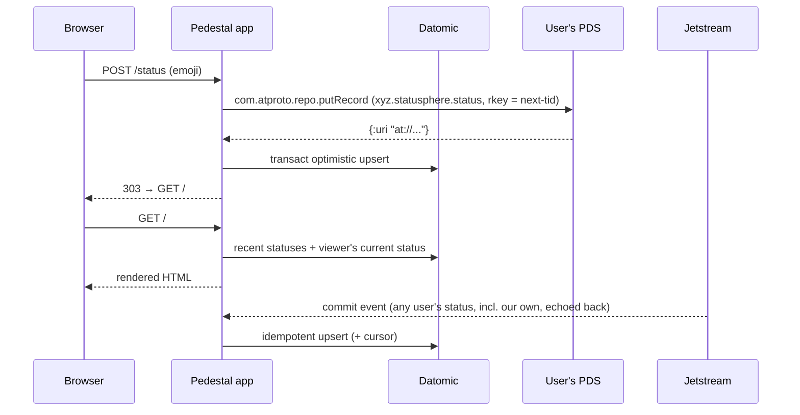
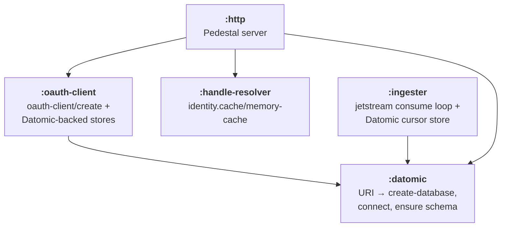

# 12: Statusphere Example App — Datomic + Component + Pedestal + Hiccup (SSR)

**Status: design — not started.**

This doc sits *outside* the WS-01…11 parity plan ([00-overview.md](00-overview.md) remains
authoritative only for those workstreams). It designs an application that *consumes* the SDK's
merged surface; it introduces no new `src/atproto/**` code and freezes no cross-workstream
contracts. Everything it depends on has already landed: OAuth sessions (WS-01), Jetstream +
cursor stores (WS-05), identity resolution & cache (WS-06), client ergonomics & TIDs (WS-07),
and lexicon validation (WS-09).

## Goal

Rebuild the [Statusphere tutorial app](https://atproto.com/guides/statusphere-tutorial) —
the canonical "my first atproto app" — as this repo's *server-side* consumer example (a
client-side example is planned separately, later), on this stack:

1. **Clojure** only — no ClojureScript, no client build step.
2. **Datomic Pro** on local dev storage as the app's read model / local index.
3. **Sierra components** (`com.stuartsierra/component`) for system structure and lifecycle.
4. **Pedestal 0.8** as the web server, used in
   [async mode](https://pedestal.io/pedestal/0.8/guides/async.html).
5. **Hiccup** for server-side rendering.
6. **Zero client-side JavaScript** — plain HTML forms and the POST/redirect/GET pattern.
7. **Async wherever possible** — the SDK is async-native, and request handling parks on
   core.async channels instead of blocking threads; blocking is confined to threads the app
   owns and to two documented sync islands.

The emphasis is *simplicity and clear, well-factored code*: someone reading the example should
come away understanding both "how do I build an atproto app" and "what does an idiomatically
factored Clojure web app look like". Every namespace should be readable top to bottom in one
sitting.

What the app exercises in the SDK, end to end:

| Concern | SDK surface |
|---|---|
| Sign in with any atproto account | `atproto.oauth.client` (authorize / callback / restore / revoke) |
| Durable OAuth state/session storage | `atproto.oauth.client.store/Store` (Datomic-backed impl) |
| Write records to the user's PDS | `atproto.client` (`init`, `procedure` → `com.atproto.repo.putRecord`), `atproto.tid` |
| Read the user's Bluesky profile | `atproto.client/query` → `com.atproto.repo.getRecord` |
| Ingest the network's statuses | `atproto.jetstream/consume` (typed events) |
| Resume ingestion across restarts | `atproto.sync.cursor/CursorStore` (Datomic-backed impl) |
| Validate records against the app lexicon | `atproto.lexicon` (`load-resources!`, `register-specs!`, `::lexicon/record`) |
| DID → handle display names | `atproto.identity/resolve-identity` + `atproto.identity.cache` |
| Observability | `atproto.runtime.cast` |

## Current state

`examples/statusphere/` already contains a Statusphere implementation on a different stack:
Ring/Jetty + Compojure, SQLite via next.jdbc, and a Reagent/ClojureScript SPA talking to the
app's own XRPC server (`atproto.xrpc.server` + `xyz.statusphere.api` handlers for
`xyz.statusphere.getStatuses|getUser|sendStatus`). It compiles the cljs client at startup
(`xyz.statusphere/build-client`), manages lifecycle with hand-rolled `start`/`stop` fns, and
has no firehose ingester wired in (`examples/statusphere/README.md:9` — "not yet"; an
`ingester.clj` exists but the main ns starts it while the README disclaims it).

**This design does not touch that implementation.** The new app lives alongside it at
`examples/statusphere-server/` as the *server-side* example — SSR, no client build, no
self-hosted XRPC API. The existing `examples/statusphere` stays as-is and is the natural
seed for a future *client-side* example (SPA + XRPC server; its own design doc, later).

Two consequences of living side by side:

- **Distinct namespace root.** The new app uses `statusphere.*` (`statusphere.system`,
  `statusphere.db`, …), not `xyz.statusphere.*` — two projects in one repo with identical
  namespace names would confuse editors/clojure-lsp and anyone grepping. The lexicon NSIDs
  are unaffected (they are data, not code).
- **Copied, not shared, resources.** `resources/public/style.css` (the TS app's stylesheet),
  `resources/statusphere-lexicons/xyz/statusphere/status.json`, and the two
  `app.bsky.actor` lexicons (needed to validate fetched profiles) are copied from the
  existing example. The query/procedure lexicons (`getStatuses.json`, `sendStatus.json`,
  `getUser.json`, `defs.json`) are not copied — with no XRPC API layer there is nothing to
  serve them. Drift between the copies is a non-risk: both sets mirror the upstream TS
  reference, not each other.

## Reference implementation guide

- **The tutorial itself**: https://atproto.com/guides/statusphere-tutorial — authoritative for
  the app's behavior and page flow.
- **TS reference app**: `bluesky-social/statusphere-example-app` — `src/index.ts` (assembly),
  `src/auth/client.ts` (OAuth), `src/ingester.ts` (firehose → DB), `src/pages/*` (SSR views;
  copy `STATUS_OPTIONS` — the ~20-emoji picker vector — verbatim from `src/pages/home.ts`),
  `src/db.ts` (the two-table schema this design maps onto Datomic).
- **The existing Clojure example** (this repo, `examples/statusphere`, untouched):
  `xyz.statusphere.auth` is close to what we want and carries over nearly unchanged (modulo
  the Datomic stores); `xyz.statusphere.ingester`'s event loop is the right shape but gains
  validation-mode binding, delete handling, and cursor persistence.

## Functional spec

### Routes

| Method | Path | Auth | Behavior |
|---|---|---|---|
| GET | `/` | optional | Home: recent-statuses feed. Logged in: emoji-picker form + greeting ("Hi, *displayName*") + logout button. Logged out: login link. |
| GET | `/login` | — | Handle-entry form. `?error=<code>` renders a fixed message mapped from the code (never echo free text). |
| POST | `/login` | — | `oauth-client/authorize` on the submitted handle → 303 redirect to the authorization URL; on error → 303 `/login?error=oauth`. |
| GET | `/oauth/callback` | — | `oauth-client/callback` → store `{:did did}` in the browser session → 303 `/`; on error → 303 `/login?error=oauth`. |
| POST | `/logout` | session | `oauth-client/revoke` + clear browser session → 303 `/`. |
| POST | `/status` | required | Validate emoji against the lexicon → `putRecord` to the viewer's PDS → optimistic local upsert → 303 `/`. |
| GET | `/client-metadata.json` | — | The OAuth client metadata (production client discovery). |
| GET | `/css/*` etc. | — | Static resources via Pedestal's `::http/resource-path`. |

Every POST answers with a 303 redirect (POST/redirect/GET) — refresh-safe, no JS.

### Data flow



Writes go to the user's own repo on their PDS (the source of truth); the app's Datomic
database is a disposable local index rebuilt from the firehose, exactly as the tutorial
prescribes. Our own writes come back via Jetstream and land as no-op upserts.

## Architecture

### Component system



Five components. Factoring rules, applied uniformly:

- **Components hold resources, not logic.** A component record's fields are its config, its
  dependencies, and whatever `start` acquired (a connection, a channel, a server). No domain
  functions live on components.
- **Logic lives in plain functions over plain values.** `db.clj` functions take a Datomic
  `db` value or `conn` — never a component. Handlers take a request map. This keeps the whole
  domain testable without starting anything.
- **Views are pure**: data in, hiccup out. No I/O in `views.clj` — handlers resolve handles,
  fetch profiles, and query Datomic, then pass finished data to the view.
- **Async by default.** Handlers are functions of `request → channel-of-response`;
  interceptors park on channels rather than block; SDK calls and Datomic writes are awaited
  with two inline idioms (see "Async model" below) rather than a wrapper layer. Blocking
  code is allowed only on threads the app owns (`a/io-thread` bodies, the ingester's
  consumer thread)
  plus two documented sync islands: peer-local Datomic reads (`d/db`/`d/q` — in-memory,
  small here) and the OAuth `Store` protocol (synchronous by contract; see Auth).
- **The system map is the only place wiring happens.** Nothing reaches into a global; the one
  deliberate exception is `lexicon/register-specs!` (a global, idempotent spec registry —
  called once in `system.clj` when constructing the system, and safe to re-run on every
  dev-workflow reset).

### Project layout

```
examples/statusphere-server/
├── deps.edn
├── config-sample.edn              ;; cp to config.edn (gitignored)
├── README.md                      ;; incl. Datomic transactor setup
├── dev/user.clj                   ;; component.repl reloaded workflow
├── resources/
│   ├── public/style.css           ;; copied from examples/statusphere (the TS app's css)
│   └── statusphere-lexicons/
│       ├── xyz/statusphere/status.json
│       └── app/bsky/actor/{profile,defs}.json
└── src/statusphere/
    ├── main.clj                   ;; -main: read config, start system, block
    ├── system.clj                 ;; system map + component defs (~all lifecycle code)
    ├── db.clj                     ;; Datomic schema (data), queries, tx builders
    ├── auth.clj                   ;; OAuth client construction + Datomic Store impls
    ├── ingester.clj               ;; jetstream event handling + cursor store
    ├── handles.clj                ;; DID → handle resolution (cached, async)
    ├── routes.clj                 ;; Pedestal routes, interceptors, handlers
    └── views.clj                  ;; hiccup pages (pure)
```

Nine source files. `system.clj` owns *all* `component/Lifecycle` implementations (they are
each a handful of lines once the logic lives elsewhere); the other namespaces export plain
functions. This keeps "what starts and stops, in what order" readable in one place.

### deps.edn

```clojure
{:paths ["src" "resources"]
 :deps {org.clojure/clojure         {:mvn/version "1.12.0"}
        org.clojure/core.async      {:mvn/version "1.8.711-beta1"} ;; used directly; match the SDK's pin
        atproto-clj/atproto-clj     {:local/root "../.."}
        com.datomic/peer            {:mvn/version "1.0.7387"}
        com.stuartsierra/component  {:mvn/version "1.1.0"}
        io.pedestal/pedestal.jetty  {:mvn/version "0.8.0"}
        hiccup/hiccup               {:mvn/version "2.0.0"}
        org.slf4j/slf4j-simple      {:mvn/version "2.0.16"}}
 :aliases
 {:dev  {:extra-paths ["dev" "test"]
         :extra-deps  {com.stuartsierra/component.repl {:mvn/version "0.2.0"}}
         :jvm-opts    ["-Datproto.runtime.cast.dev-enabled=true"]}
  :run  {:main-opts ["-m" "statusphere.main"]}
  :test {:extra-paths ["test"]
         :extra-deps  {io.github.cognitect-labs/test-runner
                       {:git/tag "v0.5.1" :git/sha "dfb30dd"}}
         :main-opts   ["-m" "cognitect.test-runner"]}}}
```

Pin all versions to current at implementation time (`com.datomic/peer` tracks the Datomic
release train — 1.0.7387 was current at design time; anything ≥ 1.0.6735 is license-free).
Datomic Pro's peer library is on Maven Central and needs no license key. Pedestal **0.8** is
required — its async interceptor support is the model this design follows; Hiccup 2 is
required (auto-escaping via `hiccup2.core/html`).

### Async model

No wrapper namespace — bridging the SDK's callback convention and Datomic's futures into
core.async takes one form each, written inline at every call site:

```clojure
;; SDK call inside a go block: every SDK async fn accepts a :channel option and
;; returns that channel, so a promise-chan composes directly with a/<! —
(a/<! (oauth-client/restore client did :channel (a/promise-chan)))

;; Datomic write inside a go block: the blocking call runs in a/io-thread —
;; a virtual thread on JDK 21+, an ordinary thread otherwise — never on a
;; shared dispatch thread. (Plain d/transact: once a thread blocks anyway,
;; transact-async buys nothing, and even its "immediate" submit does
;; connection I/O that doesn't belong on a dispatch thread.)
(a/<! (a/io-thread @(d/transact conn tx-data)))
```

These two idioms are the *only* sanctioned ways to wait on the SDK or on a Datomic write
from a request path; a bare `@`/`deref`/`<!!` in a handler or interceptor is a bug by
definition.

Pedestal's async contract (per the
[0.8 async guide](https://pedestal.io/pedestal/0.8/guides/async.html)): an interceptor that
returns a channel from `:enter`/`:leave` parks the chain, and the channel must deliver the
updated context map (one value). The operational constraint that shapes the rules above:
once a chain has gone async, subsequent interceptors run on the core.async dispatch pool
(default 8 threads) — one blocking call there degrades the whole server, which is why
blocking is confined to `a/io-thread` bodies and app-owned threads.

## Datomic design

### Why Datomic here, and which storage

The app's database is a *derived index* over the firehose — append-mostly, tiny, rebuildable.
Datomic fits naturally: upsert-by-identity models the "one row per record URI" table from the
tutorial for free, and queries are over immutable `db` values, which keeps every function in
`db.clj` pure.

- **Runtime**: `datomic:dev://localhost:4334/statusphere` — Datomic Pro dev storage (H2
  embedded in the transactor), per [Pro setup](https://docs.datomic.com/setup/pro-setup.html#get-datomic).
  The README documents: download the datomic-pro zip, run
  `bin/transactor config/samples/dev-transactor-template.properties`, wait for
  `System started`.
- **Tests and zero-install trial runs**: `datomic:mem://statusphere` — the same peer library,
  no transactor process. `config.edn`'s `:db-uri` chooses; everything else is identical.
  (`config-sample.edn` ships with the `dev://` URI per this design's brief; the README notes
  the `mem://` escape hatch.)

The `:datomic` component's `start`: `d/create-database` (idempotent) → `d/connect` →
`(d/transact conn schema)` (Datomic schema transactions are idempotent for unchanged
attribute definitions — safe on every boot). `stop`: `d/release`.

### Schema

Defined as data in `db.clj`:

| Attribute | Type | Traits | Notes |
|---|---|---|---|
| `:status/uri` | string | `:db.unique/identity` | the `at://did/xyz.statusphere.status/rkey` URI; identity ⇒ transacting is an upsert |
| `:status/author-did` | string | indexed | |
| `:status/emoji` | string | | the record's `status` field (renamed: `:status/status` reads terribly) |
| `:status/created-at` | instant | | author-asserted; untrusted network data — parse defensively, fall back to now |
| `:status/indexed-at` | instant | indexed | when *we* saw it; feed order, matching the tutorial |
| `:auth-session/key` | string | `:db.unique/identity` | OAuth session store (key = DID) |
| `:auth-session/value` | string | `:db/noHistory` | JSON blob, opaque to us; noHistory: rotated tokens shouldn't accrete in history |
| `:auth-state/key` | string | `:db.unique/identity` | OAuth pending-authorization store |
| `:auth-state/value` | string | `:db/noHistory` | JSON blob |
| `:cursor/id` | string | `:db.unique/identity` | e.g. `"jetstream"` |
| `:cursor/time-us` | long | `:db/noHistory` | Jetstream cursor (µs timestamp); noHistory: high-churn counter |

### Queries and transactions (`db.clj` sketches)

```clojure
(defn recent-statuses
  "The n most recently indexed statuses, newest first."
  [db n]
  (->> (d/index-pull db {:index    :avet
                         :selector [:status/uri :status/author-did :status/emoji
                                    :status/created-at :status/indexed-at]
                         :start    [:status/indexed-at]
                         :reverse  true})
       (take n)))

(defn current-status
  "The viewer's most recently indexed status, or nil."
  [db did]
  (->> (d/q '[:find (pull ?s [*]) :in $ ?did
              :where [?s :status/author-did ?did]]
            db did)
       (map first)
       (sort-by :status/indexed-at #(compare %2 %1))
       first))

(defn upsert-status-tx [status] [ ... ])   ;; one entity map keyed by :status/uri
(defn retract-status-tx
  "Retraction for uri, or nil if we never indexed it (guards the lookup-ref
   throw on d/transact; single-writer ingester makes the check race-free)."
  [db uri]
  (when (d/entid db [:status/uri uri])
    [[:db/retractEntity [:status/uri uri]]]))
```

`recent-statuses` walks the `:status/indexed-at` AVET index backwards — no full scan, no
sort. `current-status` scans one author's statuses (small) — fine at example scale, and the
comment says so rather than pretending to be clever.

## Web layer (Pedestal + Hiccup)

### Service map

Built in the `:http` component's `start` from config + started dependencies:

```clojure
{::http/routes         (routes/routes {:conn conn :oauth-client client :handles handles ...})
 ::http/type           :jetty
 ::http/port           port
 ::http/join?          false
 ::http/resource-path  "public"
 ::http/enable-session {:cookie-name  "sid"
                        :store        (cookie-store {:key cookie-secret})
                        :cookie-attrs {:http-only true :same-site :lax}}
 ::http/enable-csrf    {}
 ::http/secure-headers {...}}   ;; defaults, minus CSP strictness if it fights inline css
```

(Sketched with the classic `io.pedestal.http` service-map keys. Pedestal 0.8 also offers the
newer `io.pedestal.connector` API — which to use is decided at M2 and does not affect this
design: the interceptor/async semantics are identical, and under the connector API the
session/CSRF/resource interceptors are simply added explicitly from
`io.pedestal.http.ring-middlewares`.)

- **Browser session**: Ring cookie-store (encrypted, `:cookie-secret` = 16 bytes, base64 in
  config, `openssl rand -base64 16`), holding only `{:did "did:..."}`. `SameSite=Lax` is
  load-bearing: the OAuth callback is a top-level GET navigation, so the cookie is sent and
  the session survives the round trip through the authorization server.
- **CSRF**: Pedestal's built-in anti-forgery (`::http/enable-csrf`). Every form in
  `views.clj` includes the hidden `__anti-forgery-token` input via one helper; the token
  reaches views as ordinary data (`io.pedestal.http.csrf/existing-token` on the request).
  The GET callback route is unaffected — OAuth's own `state` parameter (checked by
  `oauth-client/callback` against the state store) covers that leg.

### Interceptors

Two app interceptors, defined in `routes.clj`, closed over the started components:

```clojure
(defn inject-app
  "assoc the app context (conn, oauth client, handle resolver, config) into
   the request as :app — handlers and io.pedestal.test/response-for both see it."
  [app] ...)

(def restore-viewer
  "When the browser session carries a :did, restore the OAuth session and
   attach :viewer {:did .. :client <atproto client>} to the request.
   Async: :enter returns a go block awaiting
   (oauth-client/restore client did :channel (a/promise-chan)).
   On SessionNotFound / refresh failure: log via cast, clear the browser
   session (expired cookie in the response), continue logged-out."
  ...)
```

Chain per route: `[inject-app restore-viewer handler]` (plus Pedestal's defaults —
body-params, session, CSRF — from the service map). `restore-viewer` calls
`oauth-client/restore` (which transparently refreshes stale tokens) then
`(at/init {:session oauth-session})`. Routes that require auth (`POST /status`,
`POST /logout`) 303 to `/login` when `:viewer` is absent.

### Handlers

Thin: pull what they need off the request, await `db.clj` / SDK calls, pass data to a view
or redirect. Handlers are functions of `request → channel-of-response`, written as `go`
blocks; a ~5-line `async-handler` adapter turns one into a Pedestal interceptor whose
`:enter` returns a channel delivering `(assoc context :response ...)`. Two rules keep this
honest:

- Await SDK calls with the `:channel (a/promise-chan)` idiom — never deref inside a `go`.
- Datomic writes go through `(a/<! (a/io-thread @(d/transact conn tx)))`; any other
  blocking work hops through `a/io-thread` the same way. (Peer-local reads — `d/db`, the
  small `d/q`s in `db.clj` — stay inline; they don't do I/O.)

Sketch of the interesting one:

```clojure
(defn send-status
  [{:keys [app viewer form-params] :as req}]
  (a/go
    (let [emoji  (:status form-params)
          record {:$type     "xyz.statusphere.status"
                  :status    emoji
                  :createdAt (str (Instant/now))}]
      (if-not (binding [lexicon/*schema-validate* true]   ;; sync validation — no park inside the binding
                (s/valid? ::lexicon/record record))
        (redirect "/?error=invalid-status")
        (let [{:keys [error uri]} (a/<! (at/procedure (:client viewer)
                                          {:nsid "com.atproto.repo.putRecord"
                                           :body {:repo       (:did viewer)
                                                  :collection "xyz.statusphere.status"
                                                  :rkey       (tid/next-tid)
                                                  :record     record
                                                  :validate   false}} ;; PDS doesn't know our lexicon
                                          :channel (a/promise-chan)))]
          (if error
            (do (cast/alert ...) (redirect "/?error=pds"))
            (do (a/<! (a/io-thread @(d/transact conn (db/upsert-status-tx
                                                       (optimistic uri viewer record)))))
                (redirect "/"))))))))
```

Note the `binding` of `lexicon/*schema-validate*`: it defaults to `false` (data-shape check
only); the app binds it true at its two validation sites (here and the ingester) so records
are checked against the actual `xyz.statusphere.status` schema — including `maxGraphemes 1`,
which is the server-side guard that the posted form value really is a single emoji.

The home handler composes, in one `go` block: `db/recent-statuses` →
`(a/<! (handles/<resolve-all ...))` (distinct author DIDs → handle map) → for a viewer,
`db/current-status` + a best-effort profile fetch (`com.atproto.repo.getRecord` on
`app.bsky.actor.profile/self` via the same `:channel` idiom, validated against the bundled
lexicon, falling back to the handle on any failure) → `views/home`.

### Views

`views.clj` uses `hiccup2.core/html` (auto-escaping — statuses and handles are untrusted
network data) with `{:mode :html}` and a doctype, mirroring the TS app's markup so the kept
`style.css` applies unmodified. Pure functions: `layout`, `home`, `login`, plus small
helpers (`status-form` — one submit button per emoji, `name=status value=<emoji>`;
`status-list`; `csrf-field`). The emoji vector is copied verbatim from the TS reference's
`STATUS_OPTIONS`.

## Auth (`auth.clj`)

Carries over the old example's shape, retargeted at Datomic:

- `client-metadata`: scope `"atproto transition:generic"`, redirect `<url>/oauth/callback`,
  `token_endpoint_auth_method "none"`, DPoP-bound tokens. Dev (no `:public-url`): the inline
  `http://localhost?redirect_uri=...&scope=...` client-id trick; production: client-id =
  `<public-url>/client-metadata.json`, served by the route of the same name.
- `state-store` / `session-store`: ~10-line `reify` of `atproto.oauth.client.store/Store`
  over the `:auth-state/*` / `:auth-session/*` attributes (values are JSON strings, opaque).
  This is one of the design's two deliberate sync islands: the `Store` protocol is
  synchronous by contract, and its callers are SDK internals on their own callback threads —
  never the go-dispatch pool — so the inline `d/transact` deref here is cheap and safe.
  Per the protocol docstring's growth note, `state-store`'s `set*` also lazily sweeps
  expired state entries (a
  `d/q` for entities whose JSON `:expires-at` has passed — cheap at this scale, or simply
  entries older than an hour by `:db/txInstant`).

## Ingester (`ingester.clj`)

The event loop factors into a pure-ish core and a thin shell so it's testable without a
socket:

```clojure
(defn handle-event!
  "Apply one typed Jetstream event to the index. Safe to call with any event;
   non-status events are ignored."
  [conn {:keys [kind did collection rkey uri record] :as event}]
  (when (= collection "xyz.statusphere.status")
    (case kind
      (:create :update)
      (if (binding [lexicon/*schema-validate* true]
            (s/valid? ::lexicon/record record))
        (d/transact conn (db/upsert-status-tx {...}))
        (cast/event {:message "Ignoring invalid status record" ...}))
      :delete
      (when-some [tx (db/retract-status-tx (d/db conn) uri)]
        (d/transact conn tx))
      nil)))
```

The `:ingester` component's `start`: an events chan, `(jet/consume ch :typed? true
:wanted-collections ["xyz.statusphere.status"] :cursor-store store)`, and a consumer loop
on `a/thread` draining events through `handle-event!` — a dedicated thread the app owns, so
the loop stays plain blocking code (`a/<!!`, synchronous transacts) and never touches the
go-dispatch pool. `stop`: close the control channel. Reconnection, backoff, and cursor resume are the SDK's job
(`atproto.runtime.ws`), not the app's.

**Cursor store**: `cursor.clj`-style reify over `:cursor/*` in `db.clj`, wrapped in a small
throttling decorator (persist at most every ~5s; flush on `stop`). Rationale: Jetstream
delivers network-wide `:identity`/`:account` events regardless of the collection filter, and
`consume` writes the cursor as each event is enqueued — an unthrottled store would turn a few
events/sec into a Datomic transaction each. The throttle is ~15 lines and worth the words.

Semantics note for the README: the cursor advances at enqueue time, so a crash between
enqueue and transact can skip events (at-most-once). For a rebuildable index of ephemeral
statuses this is the right trade; the alternative (app-managed cursor written after
transact) is noted in Risks and not built.

## Handle resolution (`handles.clj`)

```clojure
(defn resolver []                ;; held by the :handle-resolver component
  {:cache (identity-cache/memory-cache)})

(defn <did->handle [resolver did] ...)  ;; channel of handle; resolve-identity w/ :cache, fall back to did
(defn <resolve-all [resolver dids] ...) ;; channel of {did handle}: go block, sequential a/<! per distinct did
```

Both return channels — resolution is an SDK async call (`identity/resolve-identity ...
:cache cache :channel (a/promise-chan)`), so no thread parks on DNS/HTTP. The SDK's stale-while-revalidate cache
(`atproto.identity.cache/default-policy`) means a page render costs at most one live
resolution per never-seen DID, and repeat renders are cache hits. Views receive the
finished `{did handle}` map. Durable (Datomic-backed) handle
caching and opportunistic refresh from Jetstream `:identity` events are explicitly *not*
built — see Risks.

## Config & running

`config.edn` (from `config-sample.edn`; gitignored):

```clojure
{:port 8080
 :db-uri "datomic:dev://localhost:4334/statusphere"
 ;; 16 bytes, base64: openssl rand -base64 16
 :cookie-secret ""
 ;; optional:
 ;; :public-url "https://statusphere.example.com"
 ;; :jetstream-host "jetstream2.us-west.bsky.network"
 }
```

README run instructions: (1) start the Datomic dev transactor, (2) `cp config-sample.edn
config.edn` + fill in the secret, (3) `clojure -M:run`. `main.clj` is: read+validate config
(a `::config` spec with actionable error messages), `component/start-system`, shutdown hook
that `component/stop-system`s, park the main thread. Cast handlers (`cast/register :alert
cast/log` etc.) are registered in `main.clj` and `user.clj` — the app logs through cast like
the SDK does.

## Dev workflow (`dev/user.clj`)

`com.stuartsierra/component.repl`: `(set-init (fn [_] (system/new-system (config/load))))`,
then `(reset)` / `(stop)` / `system` at the REPL — code reload via tools.namespace comes with
it. Because `lexicon/register-specs!` is idempotent and runs in `system/new-system`, `(reset)`
re-registers cleanly. The README shows the three-line REPL session — a deliberate contrast
with the existing example's bespoke `start-dev`/`stop-dev`/`restart-dev` atoms.

## Test plan

All tests run against `datomic:mem://test-<gensym>` — no transactor, no network, CI-safe.

- **`db-test`**: schema transacts; status upsert is idempotent (same tx twice ⇒ same entity
  count); update-by-uri overwrites; `recent-statuses` ordering/limit; `current-status` picks
  latest-indexed; `retract-status-tx` nil on unknown uri, retracts on known.
- **`auth-test`**: the Datomic `Store` impls round-trip get*/set*/del*; expired auth-state
  entries are swept.
- **`ingester-test`**: `handle-event!` with fabricated typed events — valid create indexes,
  schema-invalid record is skipped (with `*schema-validate*` genuinely catching e.g. a
  two-grapheme status), delete retracts, unknown kinds/collections are no-ops. Cursor store
  round-trips; throttled store coalesces writes (injected clock).
- **`routes-test`**: `io.pedestal.test/response-for` against the service fn (it drives
  async interceptor chains transparently) with a real mem Datomic conn and a stubbed
  viewer/oauth boundary (the interceptors take the app context as data, so tests pass a
  fake `:oauth-client` map and pre-baked `:viewer`): home renders statuses + escapes
  hostile handles; `POST /status` without viewer redirects to `/login`; with viewer and a
  stubbed client, transacts the optimistic status; CSRF-less POST is rejected. Handler fns
  are also directly testable without Pedestal: call with a request map, `a/<!!` the
  returned channel.
- **`views-test`**: pure hiccup fns — smoke render + escaping of untrusted strings.
- **Live verification (manual, optional — the unit tests above are the acceptance bar; per
  project decision, offline/e2e automation is a non-goal)**: full OAuth login against a real account on
  bsky.social, status post visible in the PDS via `com.atproto.repo.listRecords`, second
  browser sees it arrive via Jetstream within seconds, restart resumes from the cursor.

## Acceptance criteria

- [ ] `clojure -M:test` green with no transactor or network available.
- [ ] `clojure -M:run` against a local dev transactor serves the full flow: login with a
      real atproto handle → set status → status appears on `/` → logout.
- [ ] Statuses posted by *other* accounts (e.g. from the TS reference app) appear in the
      feed via Jetstream without a restart; deletes disappear from the feed.
- [ ] Restarting the app neither drops nor re-processes-visibly the stream (cursor resume);
      restart with a wiped Datomic db rebuilds a working (forward-only) index.
- [ ] Zero JavaScript served; every page functional with forms alone; all user-originated
      strings HTML-escaped.
- [ ] No component reaches into another's internals; `db.clj`, `views.clj`, `handles.clj`,
      `ingester/handle-event!` all callable from a bare REPL with no system running.
- [ ] No blocking on go-dispatch/interceptor threads: SDK calls awaited via
      `:channel (a/promise-chan)`, Datomic writes via `a/io-thread` + `d/transact`;
      blocking code lives only on `a/io-thread` bodies, threads the app owns, and the
      documented sync islands.
- [ ] The existing `examples/statusphere` is untouched; the new app is fully self-contained
      under `examples/statusphere-server/` with `statusphere.*` namespaces.

## Milestones

Small PRs against `main`, each independently green, in order:

1. **M1 — skeleton + Datomic**: new `examples/statusphere-server/` project (deps.edn,
   `db.clj` schema/queries/txs, `system.clj` with `:datomic` only, `main.clj`, `user.clj`,
   `db-test`); copies `style.css` and the three needed lexicon JSONs from
   `examples/statusphere`, which is not modified.
2. **M2 — web shell**: the `async-handler` adapter (in `routes.clj`), `:http` component
   (service-map vs `io.pedestal.connector` decided here), routes/views for a logged-out
   home + static css, `views-test`, `routes-test` happy path. App browsable with seed data.
3. **M3 — OAuth**: `auth.clj` + stores, login/callback/logout routes, `restore-viewer`,
   client-metadata route, `auth-test`. Live login verified manually.
4. **M4 — status writes**: `POST /status`, lexicon registration + validation, optimistic
   upsert, greeting/profile fetch, emoji picker view.
5. **M5 — ingester**: `ingester.clj`, cursor store + throttle, `:ingester` component,
   `ingester-test`. Live firehose verified manually.
6. **M6 — polish**: README (transactor setup, REPL workflow, deploy note), config spec
   error messages, top-level `README.md` refreshed to point at both examples (server-side:
   this app; SPA: `examples/statusphere`).

## Risks & open questions

1. **Two Statusphere examples in-tree.** Resolved by decision: the existing SPA example
   stays untouched and this app lives beside it as the server-side example; a client-side
   example (likely evolving the existing one) is future work with its own design doc. The
   copied css/lexicon files mirror the upstream TS reference, so drift between the copies
   has no correctness impact.
2. **Datomic transactor is a heavier prerequisite than SQLite** for a first-run example.
   Mitigated: `datomic:mem://` works with zero setup for kicking the tires and for all tests;
   the README leads with the two-command transactor setup. Peer lib is license-free.
3. **At-most-once ingestion** (cursor advances at enqueue): acceptable for this app, and a
   deliberate simplicity trade. If it ever matters, the fix is an app-managed cursor written
   after `d/transact` instead of `consume`'s `:cursor-store` option — noted, not built.
4. **Jetstream identity/account event volume**: network-wide events reach the consumer even
   with `:wanted-collections` set. Handled by ignoring them in `handle-event!` and by the
   throttled cursor store; if volume becomes a nuisance, nothing else in the design changes.
5. **Handle staleness**: the in-memory identity cache resets per process and goes stale
   within its TTL window. Fine for an example. Possible follow-ups (not designed): Datomic-
   backed `identity.cache/Cache` impl; feeding Jetstream `:identity` events for *known* DIDs
   into the cache.
6. **Version pins** (Datomic peer, Pedestal 0.8.x, Hiccup 2.x): re-check latest at M1 and
   pin in deps.edn. Pedestal 0.8 is required (its async interceptor support is the model
   followed here); the open sub-choice is the classic `io.pedestal.http` service map vs the
   0.8 `io.pedestal.connector` API — decided at M2, with no impact on the rest of the
   design (the interceptor contract is identical in both).
7. **Async's failure mode is a stealthy block.** After the first async interceptor the rest
   of the chain runs on the core.async dispatch pool (default 8 threads); one forgotten
   blocking call — a bare `d/transact`, a deref — can jam every request under load, and it
   works fine in light testing. Mitigation is convention plus review: the two inline idioms
   in "Async model" are the only sanctioned waits on a request path, and the M2–M5 review
   checklist includes grepping `routes.clj`/`handles.clj` for `@`/`deref`/`<!!` outside an
   `a/io-thread` body.
